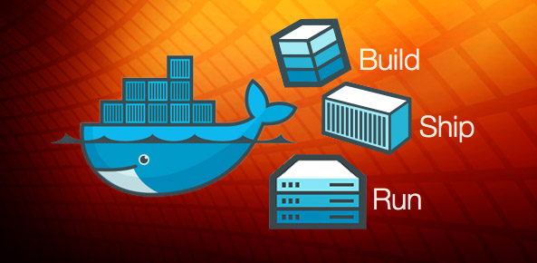
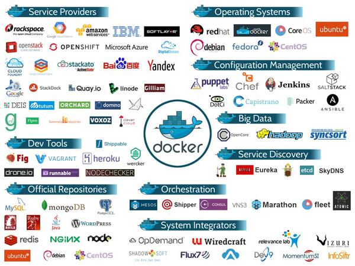

:title: Macht ihr eigentlich was mit docker?
:data-transition-duration: 1500
:css: docker.css

.. role:: strike
   :class: strike

----

:id: start

Macht ihr eigentlich was mit docker?
====================================

* Christoph Glaubitz <c.glaubitz@syseleven.de>

.. note::

   * Frage kam in Workshops immer wieder auf
   * Daher möchte ich diesen Talk nutzen um darauf einzugehen.
   * Wer von ihnen hat schon etwas von docker gehört?
   * Wer für die Entwicklung benutzt?
   * Wer in production?

----

Kurze Antwort:
==============

----

:data-rotate: 90

.. image:: nein.jpg

(https://www.netpapa.de/wp-content/uploads/2014/05/neinsagen.jpg)

.. note::

   * bzw. eher. Bisher haben wir keinen Bedarf
   * docker löst kein Problem das wir haben

     * sondern bringt hohe Komplexität

   * Es ist aber eine menge Container-KnowHow vorhanden

     * In unserer aktuellen Hosting-Platform betreiben wir Virtuozzo/OpenVZ-Container
     * Aktuell betreiben wir ~2.700 Container

   * Was aber nicht bedeutet, dass das in Zukunft so bleibt.

----

:data-rotate: 0
:id: whatisdocker

.. image:: small_v-trans.png

----

Was ist das eigentlich?
=======================

----

:data-rotate: 90
:id: dockership

"Docker enables developers and sysadmins to build, ship and run distributed applications anywhere."
===================================================================================================

https://www.docker.com/products/use-cases

.. note::

   "Docker enables developers and sysadmins to build, ship and run distributed applications anywhere."

   Die Idee:

   * Überall im Sinne von: Überall wo docker-daemon läuft
   * Die Applikation inklusive aller Abhängigkeiten paketieren in ein Image
   * Exakt dieses Image läuft als Container
   * Egal ob auf dev, q/a oder production

----

Entwicklerwerkzeug
==================

.. note::

   * Hilft bei der Entwicklung und vor allem dem Deployment von Applikationen
   * In der Tat wurde docker von Solomon Hykes als Entwicklertool begonnen
   * Entworfen um die cgroups/namespace-APIs des Linux Kernels zu bedienen
   * commit
   * push zur docker-Registry hub.docker.com oder eigene

----

API für Container
=================

.. note::

   * Verwaltet Container auf genau einem Host
   * Erlaubt aber jedem ein Tool zu schreiben im Container zu starten

     * also auch Container management software wie kubernetes

----

Container Runtime
=================

.. note::

   * Richtet eine Laufzeitumgebung ein und startet die Container
     
     * Unter Linux mittels Kernel namespaces und cgroups

   * mittlerweile auch

     * Solaris Zones
     * FreeBSD
     * Weitere werden folgen

   * In diesem Feld gibt es auch noch alternative Ansätze

     * CoreOS rocket
     * systemd-nspawn
     * beide verwenden unter Linux die selben Techniken wie docker
     * beide sind im Gegensatz zu docker Linux-Only

----

Für Application Container
=========================

.. note::

   * Die Idee ist kein komplettes Betriebssystem bzw Initsystem zu starten sondern nur einen Prozess.

     * z.B. nginx oder tomcat oder Go-Applikation

   * Container sind leichtgewichtiger als VMs

     * bringen nur das nötigste mit
     * vor allem Teilen sich die Container einen Kernel
     * Beispiel: Das alpine-linux-Image ist ~5MB klein

   * Technisch spricht allerdings nichts dagegen mehr als einen Prozess zu starten

----

bringt "Treiber"
================

* für Dateisysteme
* für Logging
* für Container

.. note::

   * Treiber für verschiedenste Dateisysteme

     * btrfs
     * ext4/overlayfs
     * zfs
     * …

   * Treiber für Logging

     * journald
     * syslog
     * fluentd
     * …

   * Treiber für Container

     * Linux namespaces und cgroups
     * Oracle Solaris Zones
     * FreeBSD
     * Windows (Mit Hilfe einer Linux-VM)
     * Demnächst nativ Mit Windows Server Container
     * …

----

und seit Version 1.7 eine Plugin-API
====================================

* http://blog.docker.com/2015/06/extending-docker-with-plugins/
* https://clusterhq.com/flocker/introduction/ (Storage)
* http://weave.works/ (Netzwerk)

.. note::

   * Plugin-API

     * für Netzwerk- und Storagelösungen

   * Wegfall von Wrapper-Scripten

     * Damit wird der docker-Workflow nicht verändert
     * Früher musste z.B. erst das Netzwerk eingerichtet werden
     * dann Umgebungsvariablen gesetzt
     * dann der Container gestartet

   * Da die Kommunikation der Plugins via http erfolgt kann es auch in != Go geschrieben sein

----

Es gibt eine Registry mit unzähligen Images auf denen aufgebaut werden kann
===========================================================================

http://hub.docker.com/

----

Dockerfile
==========
Blueprints für die Erstellung von Images
----------------------------------------

.. note::

  * Blueprints für die Erstellung von Images

----

Images, bestehend aus Layern
============================

.. image:: layer.png

.. note::

   Von unten nach oben:

   * Layer von existierenden Images werden geerben
     
     * Debian Base Image

   * Für einen Container müssen nur neue Layer herunter geladen werden

     * laufen z.B. auf einem docker-Host mehrere Container deren Base-Image debian/jessie ist, wird debian/jessie nur 1x herunter geladen

   * Eigene neue Layer hinzufügen

     * Installiere Emacs… und das obwohl die Images doch klein gehalten werden und kein eigenes Betriebssystem mitbringen sollen
     * Installiere Apache

   * Ein Container ist ein laufendes Image mit zusätzlichem Overlay

     * Hier writable

----

:data-rotate: 270

Darüber hinaus:
===============

----

Community
=========

https://www.docker.com/community

.. note::

   * Große und hilfsbereite Community
   * Viel der Entwicklung passiert außerhalb von docker inc.

----

Dokumentation
=============
https://docs.docker.com/

.. note::

   * Gute Dokumentation, viel Hintergrundwissen

----

Offenheit
=========
https://github.com/docker/

.. note::

   * docker ist Open Source
   * offen für Erweiterungen

----

Mitglied der Open Container Initiative
======================================

https://www.opencontainers.org/

.. note::

   * Mitglied der Open Container Initiative
   * Initiative im Industriestandards für Container Runtimes und Formate zu setzen

----

:id: ecosystem

Ökosystem
=========

https://www.mindmeister.com/de/389671722/docker-ecosystem

.. note::

   * Und der wichtigste Punkt
   * Ein florierendes Ökosystem

----

Kritisiert wird vor allem:
==========================
Eine Anwendung die alles macht
------------------------------
Ein root-Daemon der immer laufen muss
-------------------------------------

.. note::

   * Es wird Kritisiert:

     * dass docker als ein einzelnes Binary kommt
     * und der daemon immer als root läuft
     * In echt gibt es natürlich noch mehr kritik

----

:data-rotate: 0

Fangen wir bei der "Entwicklungsumgebung" an
============================================

----

Images bauen
============

----

.. code::

   FROM debian:latest ## currently jessie
   MAINTAINER Christoph Glaubitz <c.glaubitz@syseleven.de>

   RUN apt-get -y update && apt-get upgrade
   RUN apt-get install nginx
   ADD index.html /srv/www/index.html
   ADD start.sh /opt/start.sh

   CMD /opt/start.sh
   EXPOSE 80:8080

* https://github.com/docker-library
* https://docs.docker.com/reference/builder
* https://docs.docker.com/articles/dockerfile_best-practices/

.. note::

   * Dockerfile beschreiben

     * Jedes RUN und ADD erzeugt einen Layer
     * d.h. Lädt man in einem RUN etwas herunter muss man es auch in diesem wieder entfernen
     * Jedem dieser Schritte folg ein commit

   * Expose hat erst einmal nur dokumentierenden Charakter

     * Hier soll port 8080 des Containers als Port 80 des Hosts exponiert werden
     * man kann docker anweisen dies zu benutzen (-P)
     * aber auch beim Aufruf via Parameter überschreiben (-p 81:8080)

   * Ganz häufig wird ein start-Script geschrieben, das Environment-Variablen auswertet und den Service startet

     * etcd2 hat z.B. gar keine Konfigurationsdatei mehr…
     * … und wird vollständig via Parameter und/oder Environment-Variablen konfiguriert, kommt aber ohne extra start.sh aus

----

:strike:`Das ganze geht auch interaktiv`
========================================

* Seriously? Interaktives bauen von Images?

  * http://www.projectatomic.io/docs/docker-building-images/

.. note::

   * Diese Slide bitte vergessen
   * Es gibt sogar "seriöse" Dokumentation, die interaktives Bauen von Images beschreibt
   * Klar geht das. Ist aber wegen der Reproduzierbarkeit unbedingt von abzuraten!
   * Trotzdem interessant zum lernen.

----

Was bleibt:
-----------

Das Deployment mag reproduzierbar sein. Der gesamte Build eventuell aber nicht.
===============================================================================

.. note::

   * Das Deployment mag reproduzierbar sein. Der gesamte Build eventuell aber nicht.
   * Einer der wichtigsten Cloud-Grundsätze wird verletzt: Alles muss reproduzierbar sein
   * Also darauf achten

----

Allerdings können mit Dockerfiles nur docker-Images provisioniert werden
------------------------------------------------------------------------

Vielleicht möchte man das mit einem vorhandenen Configuration Management verbinden
==================================================================================

.. note::

   * damit man sich nicht nur auf docker festlegen muss gibt es Möglichkeiten
   * … die vielleicht schon eingesetzt werden

----

"Packer builds Docker containers without the use of Dockerfiles. By not using Dockerfiles, Packer is able to provision containers with portable scripts or configuration management systems that are not tied to Docker in any way"
-----------------------------------------------------------------------------------------------------------------------------------------------------------------------------------------------------------------------------------

https://www.packer.io/docs/builders/docker.html

.. note::

   * Packer
   * Wobei man das fairer Weise gesagt auch mit Dockerfiles hinbekommt

----

"Chef is the only platform you need to manage your containers in a versionable, testable and repeatable way."
-------------------------------------------------------------------------------------------------------------

https://www.chef.io/solutions/containers/

.. note::

   * Chef

----

"If you build a container with a pure Dockerfile, it means that the only way you can reproduce that application is in a Docker container. If you build a container with an Ansible playbook, you can then reproduce your environment in Docker, in Vagrant, on a cloud instance of your choice, or on bare metal."
------------------------------------------------------------------------------------------------------------------------------------------------------------------------------------------------------------------------------------------------------------------------------------------------------------------

http://www.ansible.com/docker

.. note::

   * Ansible

----

Combining Salt with docker
--------------------------

http://blog.xebia.com/2014/06/14/combining-salt-with-docker/

.. note::

   * Salt
   * Alle Lösungen haben einen den Vorteil

     * man ist nicht auf docker beschränkt
     * ebenso gut kann eine VM oder Baremetal provisioniert werden

   * In jedem Fall muss docker aber in den kompletten Entwicklungsprozess integriert werden…

----

Integration in Entwicklungsumgebungen und CI-Tools
==================================================

* Eclipse

  * http://www.eclipse.org/community/eclipse_newsletter/2015/june/article3.php

* IntelliJ

  * http://blog.jetbrains.com/idea/2015/03/docker-support-in-intellij-idea-14-1/

* PhpStorm (auf der Roadmap für 9.5 in Q4-2015)
 
  * https://confluence.jetbrains.com/display/PhpStorm/PhpStorm+Development+Roadmap

* Bazel

  * http://bazel.io/

* Gradle

  * https://github.com/Transmode/gradle-docker

* Travis CI

  * http://docs.travis-ci.com/user/docker/

* Jenkins

  * https://wiki.jenkins-ci.org/display/JENKINS/Docker+Plugin

.. note::

   * Eclipse
   * IntelliJ
   * PhpStorm
   * Bazel
   * Gradle
   * Travis CI
   * Jenkins

----

docker ist also mehr als docker build & run
===========================================

.. note::

   * docker ist also mehr als docker build & run
   * Es scheint das Missverständnis zu geben, dass alles total einfach und fancy ist.
     
     * In Wirklichkeit ist nur das bauen von Images einfach
     * Integration in die Entwicklungsumgebung?
     * Integration in CI?
     * Operations in production?
     * Alles macht Arbeit und es gibt einen ganzen haufen Dinge zu beachten

----

:data-rotate: 45

Das Host Betriebssystem
=======================

.. note::

   * Angefangen Beim Host-OS
   * Genügt hier nicht eine herkömmliche Linux Distri?
   * Eigentlich schon. Aber in Wirklichkeit sind die Basis-Installationen zu fett.

----

:id: containerose

* http://www.projectatomic.io/
* https://coreos.com/
* http://rancher.com/
* https://developer.ubuntu.com/en/snappy/

.. note::

   * Alles Distributionen, die auf den Betrieb von Containern optimiert sind
   * Sehr minimal. Kernel + Init + Container-Management-Tools
   * Aktualisieren das OS atomar
   * Besonderheit bei Rancher OS:

     * docker ist Pid 1
     * d.h. die Managemanet-Tools laufen in einem priviligierten Container

   * Können als Live-Images via pxeboot ohne Installation laufen gelassen werden

     * Erwähnte ich schon, dass man nicht an den Daten der Container hängen soll?

   * CoreOS bringt nicht einmal einen Paketmanager mit, was folgende Stilblüte treibt

----

Kubernetes auf CoreOS
=====================

.. code::

   [Service]
   ExecStartPre=-/usr/bin/mkdir -p /opt/bin
   ExecStartPre=/usr/bin/curl -L -o /opt/bin/kube-apiserver \
     -z /opt/bin/kube-apiserver \
     https://storage.googleapis.com/kubernetes-release/release/v0.19.3/bin/linux/amd64/kube-apiserver
   ExecStartPre=/usr/bin/chmod +x /opt/bin/kube-apiserver
   ...
   ExecStart=/opt/bin/kube-apiserver \
   ...

.. note::

   * Hier wird als ExecStartPre ein binary aus dem Internet geladen

     * ohne jedliche Verifizierung wie es bei Paket gewohnt ist

----

Konfiguration via cloud-init
============================

* Um Container horizontal zu skalieren muss die unterliegende Infrastruktur ggf. ebenfalls skaliert werden
* Kein kompliziertes und langsames Configuration Management notwendig
* Boot-Geschwindigkeit hängt auch von eingesetzten Erweiterungen ab

  * z.B. wenn erst kubernetes herunterladen

* "Cloudübergreifend"

  * AWS EC2
  * OpenStack
  * OpenNebula
  * CloudStack
  * …

.. note::

   * Initialisierung von Images via cloud-init
   * Cloudübergreifend

     * AWS EC2
     * OpenStack
     * und andere

   * Bei pxeboot kann den Images eine http-Url mitgegeben werden

----

:data-rotate: 90

Das Netzwerk
============

.. note::

   * Das eine Standardproblem im virtuellen Datacenter
   * Und auch im virtuellen virtuellen Datacenter

----

Docker Container exponieren einen lokalen Port als Port des Host systems
========================================================================

.. code::

   [...]
   EXPOSE 80:8080 # Port 8080 des Containers wird als Port 80 des Hosts exponiert

* Das heißt: Auf einem Host kann nur ein Container laufen der Port 80 exponiert.

.. note::

   * Exponiert 8080 des Containers als 80 des Hosts
   * Benutzt man nur 8080, würfelt docker den externen Port
   * Intern bekommen alle Container eine 172.17.0.0/16

     * Masquerade nach außen
     * DNAT von HOST:80 auf CONTAINER:8080

----

Kommunikation von Containern untereinander
==========================================

* Funktioniert, aber nur wenn die (interne) IP des anderen Containers bekannt ist

  * und gilt nur für Container auf dem selben Host

* Funktioniert auf die externe IP des Hosts (die im Container allerdings nicht bekannt ist)
* Funktioniert nicht auf localhost, da jeder Container einen eigenen Networknamespace mit eigenem loopback hat

.. note::

   * Funktioniert, aber nur wenn die (interne) IP des anderen Containers bekannt ist

     * und gilt nur für Container auf dem selben Host

   * Funktioniert auf die externe IP des Hosts (die im Container allerdings nicht bekannt ist)
   * Funktioniert nicht auf localhost, da jeder Container einen eigenen Networknamespace mit eigenem loopback hat
   * Vorausblick: Thema Service Discovery folgt noch

----

Es gibt Netzwerklösungen
========================

* http://weave.works/
* http://socketplane.io/
* https://github.com/coreos/flannel
* http://www.projectcalico.org/
* https://github.com/docker/libnetwork (experimental)

  * https://github.com/docker/docker/blob/master/experimental/networking.md

* http://www.opencontrail.org/
* http://www.midokura.com/midonet/

.. note::

   * Einige davon für docker entworfen
   * Die Auswahl hängt vom Umfeld ab in dem docker laufen soll

     * Benötigt man also ein overlay Netzwerk?
     * Baremetal oder OpenStack oder AWS
     * Flannel scheint sich im virtuellen Umfeld etabliert zu haben, zumindest gehen die meisten Tutorials von flannel aus

----

:data-rotate: 135

Storage
=======

.. note::

   * Das andere Standardproblem in virtuellen Datencentern

----

Nur (Host-)lokale Dateien und Verzeichnisse
===========================================

  * Es ist also nicht so einfach einen Container auf einem anderen Host zu migrieren

.. note::

   * Nur (Host-)lokale Dateien und Verzeichnisse

     * Und selbst das nur im Notfall tun
     * … da UID/GID eines Users innen und außen unterschiedlich sein können
   * Überhaupt: Wie kommen Daten in den Container?

----

Wie auch bei VMs gilt:
----------------------

Trenne die Applikation von Daten
================================

.. note::

   * Weil: Wird der Container gestoppt, sind darin enthaltene wahrscheinlich Daten weg
   * Persistente Daten (also auch benötigter state) gehören in ein Volume

     * Oder aber in ein externes DBMS

----

Teilen von Daten unter Containern
=================================

… oder --link
---------------

* Verbindet zwei Namespaces

  * Sowohl Ports, als auch Volumes

* Aber:

  * Wird der Container gegen den gelinkt wird gestoppt, wird auch der Netzwerkstack herunter gerissen

.. note::

   * Verbindet zwei Namespaces

     * Sowohl Ports, als auch Volumes

   * Aber:

     * Wird der Container gegen den gelinkt wird gestoppt, wird auch der Netzwerkstack herunter gerissen

----

Braucht man verteilten Storage…
================================

* https://clusterhq.com/

  * AWS EBS
  * Rackspace Cloud Block Storage
  * Anything that supports the OpenStack Cinder API
  * EMC ScaleIO
  * EMC XtremIO
  * Local storage using our ZFS driver (currently Experimental)

* http://www.quobyte.com/microservices.html

* http://kubernetes.io/v1.0/docs/user-guide/volumes.html

  * nfs
  * glusterfs
  * iscsi
  * rdb
  * AWS EBS

.. note::

   * Auch hier gibt es wieder Lösungen

----

:data-rotate: 180

Orchestration
=============

.. note::

   * Ein weiteres Thema über das nachgedacht werden muss sobald das Environment größer wird

----

Wann und wo läuft welcher Container?
====================================

.. note::

   * Wie gesagt, das wird erst interessante wenn es relevant viele Container zu verwalten gibt

----

Welche Container dürfen nicht zusammen laufen?
==============================================

.. note::

   * Schließlich sollen nicht alle App-Server auf einem Host laufen um Ausfallsicherheit zu bieten

----

Welche Container müssen zusammen laufen?
========================================

.. note::

   * Weil sie mittels --link zusammen gesteckt werden

----

Es gibt unzählige Lösungen
==========================

* Docker Swarm

  * https://docs.docker.com/swarm/

* CoreOS Fleet

  * https://coreos.com/using-coreos/clustering/

* Kubernetes von Google

  * http://kubernetes.io/

* Apache Mesos

  * http://mesos.apache.org/

* Atomic App

  * http://www.projectatomic.io/docs/nulecule/

----

Die vermutlich einfachste Lösung:
---------------------------------

Benutze dein Configuration Management
=====================================

* Puppet

  * https://forge.puppetlabs.com/garethr/docker

* Salt

  * https://docs.saltstack.com/en/latest/ref/states/all/salt.states.dockerio.html

* Chef

  * https://supermarket.chef.io/cookbooks/docker
  * https://docs.chef.io/containers.html (mehr als nur docker)

* Ansible

  * http://docs.ansible.com/ansible/docker_module.html

.. note::

   * Zumindest die einfachste Lösung wenn man bereits eines dieser CMs einsetzt
   * mit allen können docker-Container verwaltet werden

----

Bei der Auswahl immer darauf achten, dass die angepeilte Lösung mit den favorisierten Netzwerk- und Storagelösung zusammen spielt
=================================================================================================================================

.. note::

  * Netzwerk/Storage und Orchestration müssen zusammen passen

----

:data-rotate: 225

Service Discovery
=================

.. note::

  * Das Thema habe ich gerade schon angedroht
  * Besonders wichtig wird das in sehr dynamischen Environments

    * In denen Container über viele Hosts verteilt kommen und gehen

  * Die Services müssen sich gegenseitig finden können
  * Besonders wenn der "externe" Port von docker ausgewürfelt wird

----

DNS mit SRV
===========

.. note::

   * Ist möglich, hat aber so seine Schwierigkeiten
   * Ist eigentlich nicht so sehr für abgeschlossene Bereiche gedacht?
   * Wer pflegt die Einträge? Können Anwendung eine Änderung veranlassen?

     * Mit anderen Worten gibt es eine API?

   * Keine dynamischen Ports
   * Ist nicht dynamisch genug

----

docker, bzw. diese Art Software zu verteilen, hat andere Ansprüche geweckt
==========================================================================

.. note::

   * Und auch Lösungen herauf beschworen

----

Service Discovery Lösungen
==========================

* Zookeeper (Apache)

  * https://zookeeper.apache.org/

* etcd (CoreOS)

  * https://coreos.com/etcd/

* consul (HashiCorp)

  * https://www.consul.io/

.. note::

   * Wobei Zookeeper der Platzhirsch ist, den es auch schon vor docker gab
   * Implementieren alle Cluster-Algorithmen
   * Sind als verteiltes System gedacht
   * etcd und consul haben eine REST-API und fertige clients die damit sprechen

     * Maximal komfortabel das auch in Scripten zu verwenden

   * Sicherlich kann man sich hier auch andere Lösungen ausgedacht werden

     * Die oben genannten sind aber schon ziemlich fertig
     * Werden in verschiedensten Orchestrierungslösungen verwendet
     * docker-swarm hat z.B. für alle 3 ein Backend (https://docs.docker.com/swarm/discovery/)

----

Service Announcements möchte man von außen machen
=================================================
 
.. note::

   * also auf dem Host. Und zwar egal bei welcher Lösung

     * Dieser kennt seine externe IP
     * Kann den von docker gewürfelten Port herausfinden

   * Die Lösungen gehen alle weiter als reine Service Discovery …

     * Man kann mit ihnen nur Service Discovery implenetieren
     * Eigentlich sind es… Schared Configuration

----

Shared Configuration
====================

.. note::

   * Es können beliebige Daten baumartig gespeichert werden (trotz key/value-Store)
   * Daher auch der Name etcd

----

Z.B. der nginx-LoadBalancer, der automatisch neue App-Server hinzufügt
======================================================================

Auf dem LB läuft zusätzlich confd (http://www.confd.io/), der auf einen Key in etcd oder consul lauscht. Bei einer Änderung wir aus einem Template eine neue upstream-Konfiguration erzeugt und nginx neu geladen.

https://www.digitalocean.com/community/tutorials/how-to-use-confd-and-etcd-to-dynamically-reconfigure-services-in-coreos

.. note::

   * Es ist also nichts weiter nötig als neue App-Server-Container zu startet

----

Nicht alles ist schön
=====================

* Wer diesen Service kontrolliert, kontrolliert alles
* Services müssen also extrem gut abgesichert werden

.. note::

   * Wer diesen Service kontrolliert, kontrolliert alles
   * Services müssen also extrem gut abgesichert werden

----

Unter keinen Umständen eine solche Instanz im Internet aussetzen!
=================================================================

----

:data-rotate: 270

Eigene Registry
===============

.. note::

   * als ersatz für https://hub.docker.com/

----

Wird nötig wenn eigene Images nicht auf https://hub.docker.com/ veröffentlicht werden sollen
============================================================================================

.. note::

  * Und zwar wenn man seine Images nicht veröffentlichen möchte

----

Im einfachsten Fall
===================

.. code::

   buildhost # docker save MY_IMAGE:latest -o my_image-latest.tar

   runhost   # curl https://buildhost/my_image-latest.tar | docker load

.. note::

   * Export -> Import
   * Damit umgeht man aber das Layer-Konzept und jedes Image muss komplett herunter geladen werden

----

Öffentliche Registry, aber mit privaten Bereich (und mehr)
==========================================================

* https://quay.io/

  * "Use the Docker images your team needs with the safety of private repositories"

* https://gcr.io/

  * "Google Container Registry provides secure, private Docker image storage on Google Cloud Platform."

.. note::

   * quay.io: Eine öffentliche Registry, aber mit privaten Bereich (und mehr)

     * Entwickelt und betrieben von den CoreOS-Leuten

   * Google Container Registry

----

Möchte man den vollen "hub"-Umfang benutzen, können eigene Instanzen betrieben werden
=====================================================================================

* https://docs.docker.com/registry/
* https://github.com/docker/distribution
* https://github.com/docker/distribution/blob/master/docs/deploying.md

.. note::

   * Oder einfach die docker registry, self hosted
   * für die es natürlich ein fertiges docker-Image

     * Achtung: Storage ;)

----

:data-rotate: 315

Monitoring
==========

.. note::

   * Zumindest drüber nachdenken
   * Mit nagios kommt man im dynamischen Umfeld nicht weit

-----

:data-rotate: 360
:zoom:
:data-scale: 2

:id: fazit

docker in production ist also mehr als docker build & run
=========================================================

.. note::

   * docker kann eine Lösung sein
   * Ist aber sicherlich nicht die Lösung all unserer Probleme
   * Bei misslungenen Deployments ist meiner Erfahrung nach

     * Das gesamte Zusammenstecken verschiedener Komponenten das Problem
     * Nicht so sehr verschiedene Release-Stände auf Test/CI und Production
     * … das kann man bereits u.a. mit Configuration Management lösen
     * Das könnte also bei vielen vielen Microservices ein Problem sein
     * keep it simple!

----

:zoom:
:data-scale: 1

Der Technologie-Stack wird aufgeblasen und wirft viele fragen auf
-----------------------------------------------------------------

* Wie betreibt man die Services am besten?
* Wie müssen Services abgesichert werden?
* Welche Probleme verursacht ein Ausfall eines Services?
* Wie müssen die neuen Services überwacht werden?
* Wie können Services über die Grenze des Rechenzentrums (der Zone) miteinander kommunizieren?

.. note::

   der Technologie-Stack wird aufgeblasen und wirft viele fragen auf

   * Wie betreibt man die Services am besten?
   * Wie müssen Services abgesichert werden?
   * Welche Probleme verursacht ein Ausfall eines Services?
   * Wie müssen die neuen Services überwacht werden?
   * Wie können Services über die Grenze des Rechenzentrums (der Zone) miteinander kommunizieren?
   * um nur ein Paar zu nennen

----

Architektur der eigenen Applikationen
=====================================

* Microservices statt Monolith
* Trennung von Applikation und Daten

  * schreibe keine :strike:`relevanten` Daten in den Container

* externe Resourcen (DB-Server) via Umgebungsvariablen konfigurierbar
* Konnektoren zu etcd und consul, ggf. mittels confd
* Logging konfigurierbar

  * Im Container keine Logfiles schreiben
  * stdout/-err

* Systemanwendungen und -bibliotheken benutzen

  * selbst kompilierte third-party Software nur im Notfall
  * Falls doch: Pakete für die Distribution bauen
  * Beispiel: Python 3.5.0

* reguläre Pakete für die favorisierte Distribution bauen

  * Abhängigkeiten definieren, auch auf selbst gebaute third-party-Pakete

* Der Anwendung muss egal sein wo sie läuft

  * Container, eigene VM oder Baremetal

* Monitoring Endpunkte für gängige Monitoringsysteme
* Anwendung sollte als nicht-root laufen

.. note::

   * Microservices statt Monolith

     * Anwendung mit Web, Mobile und REST-API trennen
     * Was nicht heißt, dass diese keinen Code teilen dürfen: libraries
     * Erleichtert aber das Tauschen von komponenten
     * Und skalieren von einzelnen "Problemzonen"

   * Trennung von Applikation und Daten

     * schreibe keine :strike:`relevanten` Daten in den Container

   * externe Resourcen (DB-Server) via Umgebungsvariablen konfigurierbar
   * Konnektoren zu etcd und consul, ggf. mittels confd
   * Logging konfigurierbar

     * Im Container keine Logfiles schreiben
     * stdout/-err, Verteilen des Loggings übernimmt der Host

   * Systemanwendungen und -bibliotheken benutzen

     * selbst kompilierte third-party Software nur im Notfall
     * Falls doch: Pakete für die Distribution bauen
     * Beispiel: Python 3.5.0

   * reguläre Pakete für die favorisierte Distribution bauen

     * Abhängigkeiten definieren, auch auf selbst gebaute third-party-Pakete

   * Der Anwendung muss egal sein wo sie läuft

     * Container, eigene VM oder Baremetal

   * Monitoring Endpunkte für gängige Monitoringsysteme
   * Anwendung sollte als nicht-root laufen

----

Bauen von Images
================

* Alles muss reproduzierbar sein
* Images klein halten

  * Aufräumen mit im build-RUN-Command
  * Kein eigenständiges RUN, da die Daten trotzdem im vorherigen Layer bleiben

* Host-Volumes nur wenn unbedingt nötig

  * UID/GID können Probleme machen

* EXPOSE und VOLUME für Dinge die potentiell geteilt werden sollen
* Applikation als eigener User starten

  * USER <user>

* Wenn mehr als ein Prozess benötigt wird: servicemanager wie s6, runit, supervisord verwenden
* run.sh/init.sh soll so klein wie möglich sein

  * So viel wie möglich beim Build erledigen

* Docker and the PID 1 zombie reaping problem

  * Konnte ich in docker 1.8 nicht nachstellen, trotzdem interessant
  * https://blog.phusion.nl/2015/01/20/docker-and-the-pid-1-zombie-reaping-problem/

.. note::

   * Alles muss reproduzierbar sein
   * Images klein halten

     * Aufräumen mit im build-RUN-Command
     * Kein eigenständiges RUN, da die Daten trotzdem im vorherigen Layer bleiben

   * Host-Volumes nur wenn unbedingt nötig

     * UID/GID können Probleme machen

   * EXPOSE und VOLUME für Dinge die potentiell geteilt werden sollen
   * Applikation als eigener User starten

     * USER <user>

   * Wenn mehr als ein Prozess benötigt wird: servicemanager wie s6, runit, supervisord verwenden
   * run.sh/init.sh soll so klein wie möglich sein

     * So viel wie möglich beim Build erledigen

   * Docker and the PID 1 zombie reaping problem

     * Konnte ich in docker 1.8 nicht nachstellen, trotzdem interessant

----

Betrieb der Container
=====================

* Sende die Logs der Container an einen Logserver
* Halte Container aktuell

  * indem ein neues Image gebaut und deployed wird
  * Es ist also wichtig, dass Admins auch build und deployment anstoßen können

* Betrachte den Container als unveränderlich

  * Vielleicht mit einer Ausnahme: Kritische Sicherheitslücke

* Monitore von außen

  * Betrachte den Container als ein Prozess

.. note::
   * Sende die Logs der Container an einen Logserver
   * Halte Container aktuell

     * indem ein neues Image gebaut und deployed wird
     * Es ist also wichtig, dass Admins auch build und deployment anstoßen können
     * Vielleicht sind Entwickler im Sprint gerade weniger am beseitigen eines OpenSSL-Bugs interessiert

   * Betrachte den Container als unveränderlich

     * Vielleicht mit einer Ausnahme: Kritische Sicherheitslücke
     * Temporär: Danach schnell neues Image und ausrollen

   * Monitore von außen

     * Betrachte den Container als ein Prozess

----

Containerize everything?
========================

* Bringt mehr flexibilität

  * Selbes Setup auf OpenStack oder AWS oder … möglich

* Aber: fange klein an

  * Existierende Projekte aufzuspalten und einzeln in Container zu verpacken braucht Zeit

.. note::

   Containerize everything?

   * hohe flexibilität z.B. wenn man sich dazu entscheidet seine Applikation auch in den USA zu betreiben

     * Die Infrastruktur muss zwar noch hochgezogen werden, durch die Cloud-Images aber relativ leicht möglich

----

Ein Wort zu Container vs. VM
============================

* Container sind die Applikation
* VM, neben Baremetal, eine mögliche Infrastruktur

.. note::

   Ein Satz zu Container vs. VM

      * Container sind die Applikation
      * VM, neben Baremetal, eine mögliche Infrastruktur
      * Es gibt also kein versus

----

:id: fragen

Vielen Dank für die Aufmerksamkeit!
-----------------------------------

Fragen?
=======

----

:id: resources

Resources
=========

* http://blog.docker.com/2015/06/extending-docker-with-plugins/
* https://www.opencontainers.org/
* https://www.docker.com/whatisdocker
* https://www.docker.com/products/use-cases
* https://www.docker.com/community
* https://www.mindmeister.com/de/389671722/open-container-ecosystem-formerly-docker-ecosystem
* https://docs.docker.com/
* http://www.theregister.co.uk/2015/07/30/docker_container_support_on_solaris/
* https://www.domenkozar.com/2014/03/11/why-puppet-chef-ansible-arent-good-enough-and-we-can-do-better/
* http://nixos.org/
* https://wiki.freebsd.org/Docker
* http://www.golem.de/news/docker-vorschau-auf-windows-server-2016-enthaelt-container-1508-115858.html
* https://clusterhq.com/flocker/introduction/
* http://weave.works/
* https://valdhaus.co/writings/docker-misconceptions/
* https://marc.info/?l=openbsd-misc&m=119318909016582
* https://coreos.com/blog/rocket/
* http://www.freedesktop.org/software/systemd/man/systemd-nspawn.html
* http://kubernetes.io/
* http://mesos.apache.org/
* https://www.packer.io/docs/builders/docker.html
* http://www.eightypercent.net/post/layers-in-the-stack.html
* https://blog.abevoelker.com/why-i-dont-use-docker-much-anymore/
* https://blog.phusion.nl/2015/01/20/docker-and-the-pid-1-zombie-reaping-problem/
* https://blog.phusion.nl/2015/01/20/baseimage-docker-fat-containers-treating-containers-vms/
* http://www.dasblinkenlichten.com/kubernetes-101-networking/
* http://de.slideshare.net/oscarrenalias/containerize-everything-48225778
